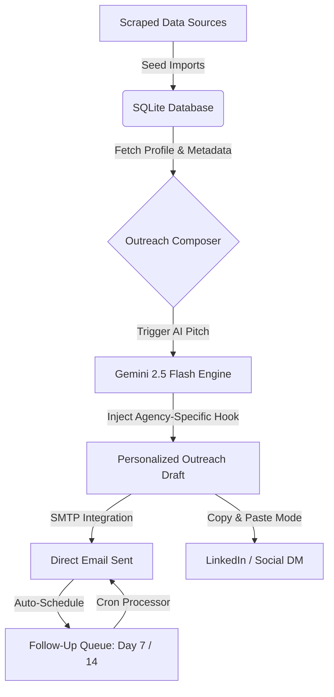

<div align="center">

# 🚀 LeadLift

### *Next-Gen AI-Powered Marketing & Partnership Automation Engine*

[](https://python.org)
[](https://fastapi.tiangolo.com)
[](https://sqlite.org)
[](https://aistudio.google.com)
[](https://opensource.org/licenses/MIT)

A premium, self-hosted single-page marketing automation dashboard engineered for growth managers and agencies. Streamline medical aesthetics outreach from lead scraping to signed partnerships with hyper-personalized AI engines, integrated email delivery, and pipeline tracking.

[View Dashboard Demo](#-interactive-system-tour) • [Installation Guide](#-quick-start) • [Configure Automation](#-configuration--setup)

</div>

---

## ⚡ Key Capabilities

- **📊 Command Center**: High-impact metrics (KPIs) showing total leads, enriched contacts, outreach statistics, and a visual target deadline countdown.
- **🔄 Kanban Pipeline Board**: Seamless drag-and-drop mechanics to move target contacts from *Scraped* to *Contacted*, *Meeting Booked*, or *Signed*.
- **🏢 Deep Lead Profiling**: Pre-loaded database of **50 target clinic/agency leads** complete with location, service listings, and custom partnership scoring.
- **👤 Decision-Maker Catalog**: Comprehensive database of **24 decision-makers** pre-mapped to their respective firms with emails and LinkedIn profiles.
- **✉️ AI Pitch Generation**: Direct integration with **Gemini 2.5 Flash** leveraging **15 custom agency hooks** (e.g., custom CRM integrations, conversion lift case studies) to write hyper-relevant, non-salesy outreach messages.
- **📅 Active Scheduling & SMTP**: Integrated SMTP mail routing with automatic follow-up sequence scheduling (Day 7 and Day 14 cadences).
- **💅 Premium Glassmorphic UI**: Beautiful dark-mode dashboard styled with responsive design, card animations, and crisp typography.

---

## ⚙️ How the Automation Works

The engine automates the entire outreach lifecycle:



---

## 📂 Project Structure

```
├── static/
│   ├── index.html       # Single Page Application (SPA) structure & modals
│   ├── styles.css       # Premium Dark-theme design tokens & styling
│   └── app.js           # Frontend router, reactive state, charts, & API links
├── data/
│   ├── agency_leads.csv # Pre-compiled target agency leads
│   └── *.csv            # Context data (decision-makers, logs, templates)
├── app.py               # FastAPI backend server & REST API layer
├── database.py          # SQLite database model creation & automated migrations
├── automation.py        # Gemini AI prompt engine & SMTP follow-up pipelines
├── requirements.txt     # Locked project Python dependencies
└── .gitignore           # Multi-layered Git ignore exclusions
```

---

## 🚀 Quick Start

### 1. Pre-requisites
Ensure you have **Python 3.10+** installed on your system.

### 2. Setup the Repository
```bash
git clone https://github.com/ak0425906-star/sales-marketing.git
cd sales-marketing
```

### 3. Create & Activate Virtual Environment
**Windows:**
```powershell
python -m venv venv
.\venv\Scripts\activate
```

**macOS/Linux:**
```bash
python -m venv venv
source venv/bin/activate
```

### 4. Install Dependencies
```bash
pip install -r requirements.txt
```

### 5. Run the Engine
```bash
python app.py
```
Open **[http://localhost:8000](http://localhost:8000)** in your browser.

---

## ⚙️ Configuration & Setup

Once the dashboard is running, navigate to the **Settings** (⚙️) tab in the sidebar and complete the setup:

| Category | Input Name | Description | Priority |
| :--- | :--- | :--- | :---: |
| **Sender Profile** | Your Name & Title | Used for formatting email/LinkedIn signatures | 🔴 Required |
| **Outreach** | Sender Email | The address emails will be dispatched from | 🔴 Required |
| **AI Personalization** | Gemini API Key | Create a free key at [Google AI Studio](https://aistudio.google.com/apikey) | 🟡 Highly Recommended |
| **Email Delivery** | SMTP Password | Generate a **Google App Password** for automated sending | 🟡 Highly Recommended |
| **Meetings** | Calendly Link | Booking link automatically added to AI emails | 🟢 Optional |

> [!TIP]
> **Manual Mode Working:** The system works fully in fallback mode even without API credentials. You can view all structured data, use the pipeline, copy message templates, and log outreach steps manually.

---

## 🛡️ License

Distributed under the MIT License. See [LICENSE](LICENSE) for more information.

<div align="center">
  <sub>Developed for Cosmasol Growth Engine • Version 1.0.0</sub>
</div>
